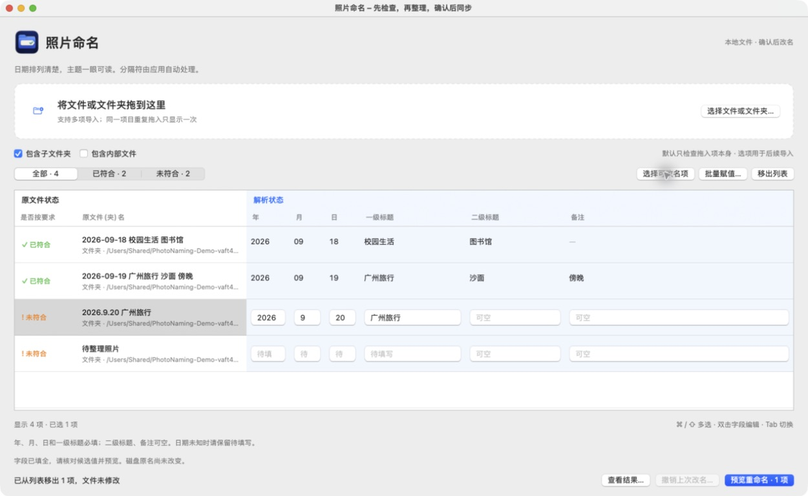

<a id="english"></a>

<p align="center">
  
</p>

<h1 align="center">PhotoNaming · 照片命名</h1>

<p align="center"><strong>Clear names. Confirmed changes. Recoverable mistakes.</strong></p>

[](#english)
[](#中文)

[](https://github.com/QiushanHuang/PhotoNaming/releases)
[](https://github.com/QiushanHuang/PhotoNaming/actions/workflows/ci.yml)
[](https://github.com/QiushanHuang/PhotoNaming/releases/latest)
[](https://github.com/QiushanHuang/PhotoNaming/releases/latest)
[](Package.swift)
[](LICENSE)

**Turn inconsistent file and folder names into clear dates, events, places and notes.**
PhotoNaming is a native macOS app that puts the original name beside six editable
fields, highlights the items that need attention, and writes your reviewed changes
back to the actual files. Everything stays on your Mac.

## Why choose PhotoNaming

A photo collection can contain `2026.9.20 Trip`, `New folder`, and neatly organized
folders at the same time. Some need a date, some need a title, and others need no
change at all. Applying one text replacement to the whole collection leaves
those different decisions to you.

PhotoNaming brings those decisions into one table:

- **Fix only what needs fixing.** Filter non-compliant names and keep already
  compliant rows read-only. Useful values are parsed for you; unknown dates stay
  blank for your review.
- **Work with meaningful fields.** Fill in dates, titles and notes instead of
  assembling separators or writing a renaming expression. Edit individual rows
  or apply the same value to selected fields across several rows.
- **Keep control when names reach the disk.** See original and proposed names
  before confirming. Existing targets are not overwritten, results are reported
  per item, and completed renames have persistent undo records.

### Where common approaches become extra work

| Approach | Friction in a mixed collection | PhotoNaming's advantage |
| --- | --- | --- |
| Rename folders one by one in Finder | Repeating dates and separators, then manually checking consistency | Six structured fields, calendar validation and automatic formatting |
| Simple find/replace, prefixing or numbering | Different missing dates and titles need different corrections | Per-row repair alongside selective batch field assignment |
| Plan names in a separate spreadsheet | The plan still has to be transferred to the right files | Original names, editable fields and confirmed disk changes in one workflow |
| Write a one-off script | Preview, collision checks, partial-result reporting and undo need to be implemented | These steps are built into the application |

### A good fit for

- **Travel and family collections:** standardize dates, events and locations
  across folders gathered from different occasions.
- **An old photo archive:** quickly separate consistent names from the backlog
  and complete missing information without redoing the whole collection.
- **Study and project folders:** apply a shared date/title convention while
  keeping a different secondary title or note for each item.

**The workflow:** import → filter → fill in fields → preview → confirm → undo if needed.
The focus is human-reviewed naming. This version does not identify photo contents,
extract EXIF dates or replace an arbitrary regular-expression pipeline.



*Actual application with synthetic demo folders. Version 1.0 uses a Chinese
interface; both English and Chinese instructions are included below.*

## Install

Download the **Apple Silicon / arm64** package from
[the latest release](https://github.com/QiushanHuang/PhotoNaming/releases/latest).
Requires **macOS 14 or later**. Intel Mac binaries are not included in this release.

- **DMG:** open the disk image and drag `照片命名.app` to Applications, then eject it.
- **ZIP:** unzip, then move `照片命名.app` to Applications or another folder you own.
- Both include an offline bilingual guide and the MIT license. No terminal setup is needed.

**Signing:** the app is ad-hoc signed, **not Developer ID signed or Apple-notarized**.
If macOS blocks the first launch, verify that you downloaded it from this repository,
then follow Apple's per-app **System Settings → Privacy & Security → Open Anyway**
flow. See [Apple's instructions](https://support.apple.com/102445).
Do not disable Gatekeeper globally.

Optional download verification, with both release archives and `SHA256SUMS.txt`
in the same folder:

```sh
shasum -a 256 -c SHA256SUMS.txt
```

If you download only one archive, compare its `shasum -a 256` output with its
matching line in `SHA256SUMS.txt`.

## Start here

1. Drag folders/files into the drop area, or click **选择文件或文件夹…** (Choose files or folders).
   By default, only the items you import are checked. Enable **包含子文件夹**
   (Include subfolders) and/or **包含内部文件** (Include contained files) **before**
   importing when you want recursive scanning.
2. Select **未符合** (Non-compliant). Gray columns retain the original name and
   status; blue columns contain the parsed fields. Known values are retained;
   unknown dates remain blank.
3. Fill in the fields. Use **⌘ / ⇧** to select multiple rows and **批量赋值…**
   (Batch assign) to replace only the fields you check. A checked blank value
   clears that field; unchecked fields keep their values.
4. Select the rows to rename. **选择可改名项** selects valid non-compliant rows in
   the current filter. Click **预览重命名** (Preview), review the names and locations,
   then **确认并重命名** (Confirm and rename).
5. Read the result. A successful rename is re-read and parsed from disk before
   its table status becomes compliant. **撤销上次改名…** (Undo last rename) previews
   the reverse operations and asks for confirmation.

| Interface label | Meaning |
| --- | --- |
| 全部 / 已符合 / 未符合 | All / compliant / non-compliant original names |
| 原文件状态 | Original status: compliance and original file/folder name |
| 解析状态 | Parsed fields: year, month, day, primary title, secondary title, note |
| 移出列表 | Remove from the table; does not delete or rename anything |
| 在 Finder 中显示 | Reveal the selected item in Finder (right-click a row) |
| 查看结果 | View completed, failed or skipped operations |

The [detailed user guide](docs/USER_GUIDE.md) covers examples, conflict handling,
undo, privacy and troubleshooting. **Unsubmitted edits are session-only** and
are lost when the app closes; completed-operation history is persistent.

## Naming rule

```text
YYYY-MM-DD_primary-title_secondary-title_note.ext
```

Date and primary title are required; secondary title and note are optional.
The last file extension is preserved. Folders are not split at a dot.
Trailing empty fields are omitted; an empty field in the middle keeps its position.

| Fields | Actual disk name |
| --- | --- |
| Date + primary title | `2026-09-20_Family gathering` |
| Add a secondary title | `2026-09-20_Family gathering_Garden` |
| Note with no secondary title | `2026-09-20_Family gathering__Favorites` |
| A photo file | `2026-09-20_Family gathering_Garden_Favorites.jpg` |

The table displays separators as spaces. The real filename retains the underscores.
Do not type underscores inside fields. Dates must be real calendar dates;
creation/modification times are never substituted for an unknown date.
An obvious date in a non-standard name may become a candidate for you to review.

## Rename and recovery behavior

- Changes happen only after you confirm the selected preview. Existing targets
  are not overwritten; duplicate targets within a batch are rejected.
- Source and parent identities are checked again before execution. Files that
  have moved or been replaced are reported instead of silently accepted.
- Nested selections are renamed deepest-first; undo reverses that order.
  Each operation is logged before it starts, and partial failures are reported.
- This is **not an all-or-nothing batch transaction**. Completed operations remain
  completed when a later item fails. Undo stops on a conflict or an externally moved item.
- Hidden items, symbolic links, special files and file/application packages are skipped.
- History is stored in `~/Library/Application Support/PhotoNaming/History/`.
  It contains full paths. Preserve it for cross-session undo and keep it private.

Local APFS workflows have been tested. Network/cloud-mounted drives, very large
collections and a real Finder-to-app drag gesture have not yet been verified;
use the file picker if drag import behaves differently on your setup.

## Build and contribute

Requires macOS, **Xcode 16+ / Swift 6+** and Python 3 for documentation checks.
There are no third-party package dependencies.

```sh
git clone https://github.com/QiushanHuang/PhotoNaming.git
cd PhotoNaming
swift test
swift test -c release
python3 scripts/check-docs.py
bash scripts/build-app.sh
bash scripts/verify-app.sh
open dist/照片命名.app
```

`bash scripts/package-release.sh` creates the distributable archives and checksums.
See [Contributing](CONTRIBUTING.md), [Changelog](CHANGELOG.md),
[security and privacy](SECURITY.md) and [v1.0.0 release notes](docs/releases/v1.0.0.md).

Created and maintained by **[Qiushan · @QiushanHuang](https://github.com/QiushanHuang)**.
See [contributors and attribution](CONTRIBUTORS.md). Licensed under the
[MIT License](LICENSE). The [logo and design brief](assets/branding/README.md)
are included in the repository.

---

<a id="中文"></a>

## 中文

[](#english)
[](#中文)

**把混乱的文件名拆成清楚的日期、事件、地点和备注，再确认写回真实文件。**
PhotoNaming 是一个原生 macOS 命名工具：左边保留原名，右边像表格一样填写六个字段，
先筛出需要处理的项目，再预览和确认改名。整个过程都在你的 Mac 上完成。

### 为什么需要它，为什么选它

一批照片文件夹里，可能同时存在 `2026.9.20 旅行`、`新建文件夹`，以及已经整理好的规范名称。
有些缺日期，有些缺主题，有些完全不需要改。面对这种情况，统一替换一段文字，
仍然需要你逐个判断每个名字应该表达什么。

PhotoNaming 把这些判断集中到一张表里，主要解决三件事：

- **只整理有问题的部分。** 一键筛出未符合项，已符合项完整解析并保持只读。
  能识别的内容保留，不知道的日期留给你确认，减少重复录入。
- **填写信息，少操心格式。** 直接填日期、标题、备注，不必逐个拼下划线或编写改名表达式。
  每行可以单独修正，也能只对选中的几列统一赋值。
- **改之前看得清，改之后有记录。** 原名和新名先对照预览，确认后才写入。
  同名不覆盖，逐项报告结果，已完成操作保留可跨重启使用的撤销记录。

### 常见方案的痛点，我们怎样解决

| 常见做法 | 面对混合命名时的麻烦 | PhotoNaming 的优势 |
| --- | --- | --- |
| 在 Finder 里逐个改名 | 反复输入日期与分隔符，还要自己检查是否统一 | 六字段填写、日期校验、自动生成规范名称 |
| 简单批量替换、加前缀或编号 | 不同项目缺少的信息不同，一条规则难以完成逐项修正 | 单行修正与按字段批量赋值结合 |
| 先在表格里列好新名字 | 还要把结果准确对应并写回磁盘，计划与执行分成两步 | 原名、编辑和确认写回放在同一个流程里 |
| 自己写一次性脚本 | 还需实现预览、冲突检查、部分失败处理与撤销记录 | 这些步骤已集成，按界面操作即可 |

### 哪些场景值得用

- **旅行与家庭照片：** 不同活动留下的文件夹日期写法各异，需要统一日期、事件与地点。
- **积累多年的照片归档：** 先把已经规范的部分筛开，只补齐剩余文件夹的信息。
- **学习与项目资料：** 统一日期和主题，同时为各个项目保留不同的二级标题与备注。

**使用流程：导入 → 筛选 → 填写 → 预览 → 确认改名 → 必要时撤销。**
本版专注由你核对的信息整理，不识别照片内容、不提取 EXIF 日期，也不提供任意正则改名流水线。


*截图来自真实应用，使用专门创建的模拟文件夹；1.0 版应用界面为中文。*

### 安装

从[最新发布页](https://github.com/QiushanHuang/PhotoNaming/releases/latest)下载
**Apple Silicon / arm64** 安装包，需要 **macOS 14 或更新版本**。
本次发布不包含 Intel Mac 二进制包。

- **DMG：** 打开磁盘映像，将 `照片命名.app` 拖入 Applications，然后推出映像。
- **ZIP：** 解压后，将 `照片命名.app` 移入应用程序目录或你自己的其他目录。
- 两种包都附带中英双语离线说明和 MIT 许可证，无需安装额外运行环境。

**签名说明：** 应用使用本地临时签名，**没有 Developer ID 签名，也未经 Apple 公证**。
若首次打开被拦截，先核实下载来源，再按 Apple 的单应用放行流程进入
**系统设置 → 隐私与安全性 → 仍要打开**。具体操作见 [Apple 官方说明](https://support.apple.com/102445)。
不需要全局关闭 Gatekeeper。

可将两个安装包和 `SHA256SUMS.txt` 放在同一目录，运行：

```sh
shasum -a 256 -c SHA256SUMS.txt
```

只下载其中一个包时，用 `shasum -a 256 文件名`，与校验文件中的对应行比较即可。

### 快速开始

1. 将文件或文件夹拖到上方区域，或点击 **选择文件或文件夹…**。
   默认只检查拖入项；要检查内部内容，先勾选 **包含子文件夹** 或 **包含内部文件**，再导入。
2. 切换到 **未符合**。灰色两列保留原文件状态与名称，蓝色六列显示解析结果。
   能确定的信息保留，不知道的日期留空。
3. 填写蓝色单元格，用 **Tab** 切换。按 **⌘ / ⇧** 多选，使用 **批量赋值…**
   统一修改勾选字段；勾选后留空表示清空，未勾选的字段保持原值。
4. 选中要改名的行。**选择可改名项** 会选中当前筛选中字段有效的未符合项。
   点击 **预览重命名**，核对原名、新名和位置，然后点击 **确认并重命名**。
5. 完成后重新读取实际名称并解析，通过后才归入 **已符合**。
   需要恢复时点击 **撤销上次改名…**，核对逆向清单并确认。

| 界面入口 | 作用 |
| --- | --- |
| 全部 / 已符合 / 未符合 | 根据磁盘原名分类，草稿不会提前改变原名状态 |
| 原文件状态 | 是否按要求、原文件或文件夹名称 |
| 解析状态 | 年、月、日、一级标题、二级标题、备注 |
| 移出列表 | 只移除表格行，不删除、不改名 |
| 在 Finder 中显示 | 右键行，定位真实文件 |
| 查看结果 | 查看完成、失败、跳过及撤销结果 |

详见[完整操作指南](docs/USER_GUIDE.md#中文指南)。
**尚未提交的编辑仅保留在当前会话，关闭应用会丢失；已完成操作的历史记录会持久保存。**

### 命名规则

```text
YYYY-MM-DD_一级标题_二级标题_备注.扩展名
```

日期与一级标题必填；二级标题、备注可空。文件保留最后一个扩展名，文件夹不按点号拆分。
末尾空字段省略，中间空字段保留位置。

| 填写内容 | 真实名称 |
| --- | --- |
| 日期和一级标题 | `2026-09-20_家庭聚会` |
| 增加二级标题 | `2026-09-20_家庭聚会_花园` |
| 没有二级标题，但有备注 | `2026-09-20_家庭聚会__精选` |
| 照片文件 | `2026-09-20_家庭聚会_花园_精选.jpg` |

下划线在表格里显示为空格，真实名称中仍然保留；不要在字段内手动填写下划线。
日期必须真实有效，应用不会把创建/修改时间当成未知的拍摄日期。
非标准名称里能识别的日期只作为候选，仍需你核对。跨日内容可用起始日，并在备注说明范围。

### 改名与恢复

- 仅在你确认选中项目的预览后改名。已有目标不覆盖，同一批次产生相同目标会被拦截。
- 执行前再次核对源项目和父目录身份，外部移动或替换会被报告。
- 同时选中父子目录时先改深层项目，撤销时反向处理；每项开始前先保存日志。
- **批量改名不是原子事务**：后续失败不会自动回滚已成功项。撤销遇到冲突或外部移动时停止。
- 隐藏项目、符号链接、特殊文件及应用包/文件包会跳过，并在结果中说明。
- 历史记录位于 `~/Library/Application Support/PhotoNaming/History/`，包含完整路径。
  跨会话撤销需要保留记录，请勿公开自己的日志。

已验证本地 APFS 上的操作。网络盘、云挂载盘、超大集合和真实 Finder 拖拽手势尚未实测；
如果拖入表现异常，可先使用文件选择按钮。

### 开发与贡献

需要 macOS、**Xcode 16+ / Swift 6+**；文档检查使用 Python 3，无第三方包依赖。

```sh
git clone https://github.com/QiushanHuang/PhotoNaming.git
cd PhotoNaming
swift test
swift test -c release
python3 scripts/check-docs.py
bash scripts/build-app.sh
bash scripts/verify-app.sh
open dist/照片命名.app
```

运行 `bash scripts/package-release.sh` 可生成安装包与校验和。
[贡献指南](CONTRIBUTING.md) · [更新记录](CHANGELOG.md) · [安全与隐私](SECURITY.md) ·
[v1.0.0 发布说明](docs/releases/v1.0.0.md)

作者与维护者：**[Qiushan · @QiushanHuang](https://github.com/QiushanHuang)**。
[贡献署名](CONTRIBUTORS.md) · [MIT 许可证](LICENSE) · [Logo 与设计说明](assets/branding/README.md)

[返回英文 / Back to English ↑](#english)
